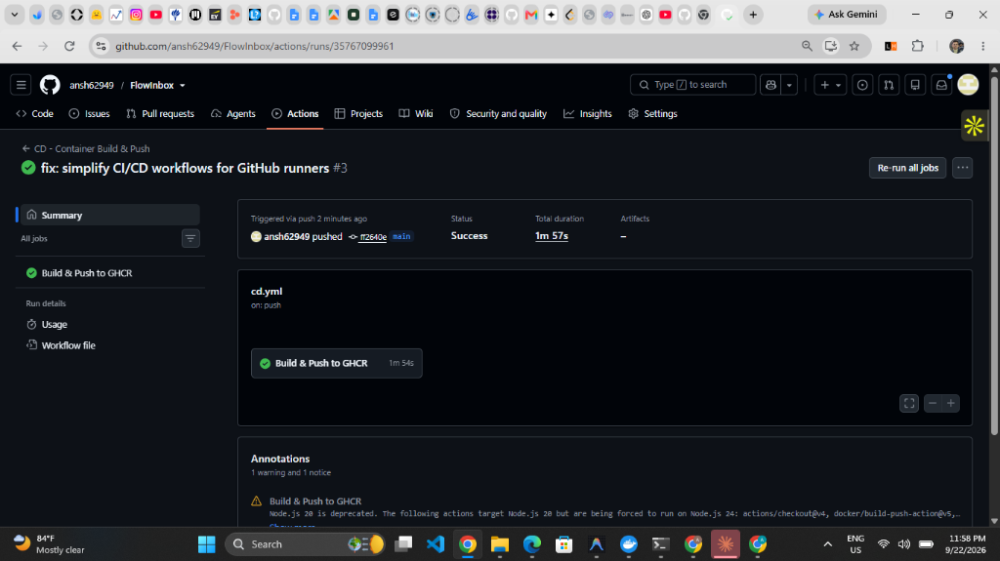
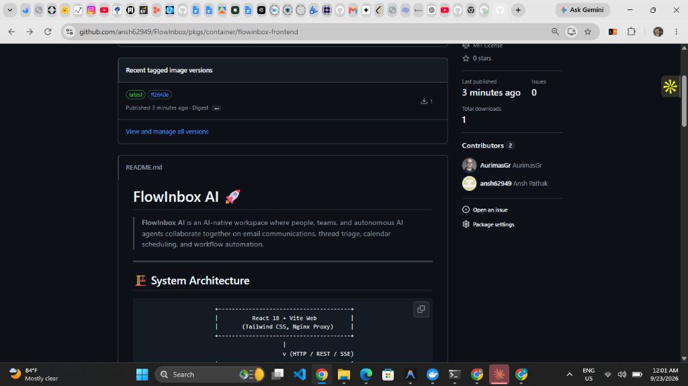

# FlowInbox AI 🚀

[](https://github.com/ansh62949/FlowInbox/actions/workflows/ci.yml)
[](https://github.com/ansh62949/FlowInbox/actions/workflows/cd.yml)

> **FlowInbox AI** is an AI-native workspace where people, teams, and autonomous AI agents collaborate together on email communications, thread triage, calendar scheduling, and workflow automation.

---

## 🏗 System Architecture

```text
                      +---------------------------------------+
                      |          React 18 + Vite Web          |
                      |       (Tailwind CSS, Nginx Proxy)     |
                      +---------------------------------------+
                                          |
                                          v (HTTP / REST / SSE)
                      +---------------------------------------+
                      |         FastAPI Async Backend         |
                      |   (LangGraph Agent, Async SQLAlchemy) |
                      +---------------------------------------+
                               /          |          \
                              /           |           \
                             v            v            v
                +-----------------+  +---------+  +-----------------+
                |   PostgreSQL    |  |  Redis  |  |  Qdrant Vector  |
                | (Relational DB) |  | (Cache) |  |   (Hybrid RAG)  |
                +-----------------+  +---------+  +-----------------+
```

---

## 🛠 Tech Stack

* **Frontend**: React 18, Vite, Tailwind CSS, Framer Motion, Lucide Icons
* **Backend**: Python 3.11, FastAPI, Async SQLAlchemy 2.0, Alembic, Pydantic v2
* **Agent Orchestration**: LangGraph StateGraph, Model Context Protocol (MCP)
* **LLM Engine & Routing**: Groq (`llama-3.3-70b-versatile`) primary tool caller, Google Gemini fallback
* **Vector Store & RAG**: Qdrant Vector Store, Dense Vector Embeddings + PostgreSQL Full-Text Search (FTS) merged via Reciprocal Rank Fusion (RRF)
* **Infrastructure**: Docker Compose, Kubernetes (`kind`), GitHub Actions CI/CD with GitHub Container Registry (GHCR)

---

## ✨ Key Features

1. **Google Workspace Sync**: Direct OAuth 2.0 connection to live Gmail threads and Google Calendar events.
2. **Deep Email Analysis & Grounded Drafting**: One-click synthesis of intent, sender context, sentiment, urgency scores, and grounded reply options.
3. **Human-in-the-Loop Safety Gate**: Consequential actions (`send_email`, `create_calendar_event`) generate a pending approval request requiring explicit human sign-off before dispatching.
4. **Model Context Protocol (MCP)**: Native stdio and HTTP SSE endpoints allowing external tools (Claude Desktop, Cursor IDE) to query inbox tools directly.
5. **Team Channels & Thread Collaboration**: Shared workspace channels and thread-level comments for real-time human and AI agent collaboration.
6. **Autonomous Background Engines**: `Needs Reply Engine` and `Followup Engine` for automated message triage and reminder tracking.

---

## ⚡ Quick Start & Development

### 1. Database & Backend Services
```bash
# Navigate to backend directory
cd flowinbox/backend

# Install Python dependencies
py -3 -m pip install -r requirements.txt

# Run database migrations
py -3 -m alembic upgrade head

# Start Uvicorn development server
py -3 -m uvicorn app.main:app --port 8000 --reload
```

### 2. Frontend Application
```bash
# Navigate to frontend directory
cd flowinbox/frontend

# Install dependencies
npm install

# Launch Vite development server
npm run dev
```
Open `http://localhost:3000` in your browser.

### 3. Docker Compose (Full Stack)
```bash
cd flowinbox
docker compose up --build
```

---

## 🧪 Verification & Testing

Run the full automated backend test suite (16 tests passing):
```bash
cd flowinbox/backend
py -3 -m pytest tests/
```

Run frontend build verification:
```bash
cd flowinbox/frontend
npm run build
```

---

## ☸️ Local Kubernetes Deployment & Proof-of-Work

FlowInbox AI includes production-aligned Kubernetes manifests designed for multi-service orchestration on local `kind` clusters or cloud Kubernetes environments.

This cluster setup coordinates 5 microservices in the `flowinbox` namespace: **Backend API**, **Frontend React SPA**, **PostgreSQL**, **Qdrant Vector Store**, and **Redis Cache**, backed by persistent storage volumes and automated health probes.

### Cluster Status & Health Check Evidence (Captured 09/22/2026)



```bash
$ kubectl get pods -n flowinbox
NAME                        READY   STATUS    RESTARTS   AGE
backend-5f6557bfd5-z85jh   1/1     Running   4 (11m ago) 12m
frontend-55bf8ddfcb-lhpmx   1/1     Running   0          12m
postgres-795c87974-w2bdf    1/1     Running   0          12m
qdrant-6cb47c449-m99vz      1/1     Running   0          12m
redis-6688b7946-c5rwz       1/1     Running   0          12m

$ curl.exe http://localhost:8000/api/v1/health
{"status":"healthy","project":"FlowInbox AI","environment":"development","database":"ok","vector_store":"qdrant","llm_provider":"groq"}

$ kubectl port-forward -n flowinbox svc/frontend 3000:80
Forwarding from 127.0.0.1:3000 -> 80
Forwarding from [::1]:3000 -> 80
```

### Kubernetes Self-Healing Demonstration

The backend Deployment automatically maintains target replica availability. When a running pod is manually deleted, Kubernetes immediately schedules a replacement pod without service downtime:



```bash
$ kubectl delete pod -n flowinbox -l app=backend
pod "backend-5f6557bfd5-z85jh" deleted from flowinbox namespace

$ kubectl get pods -n flowinbox
NAME                        READY   STATUS    RESTARTS   AGE
backend-5f6557bfd5-8qp8l    0/1     Running   0          4s
frontend-55bf8ddfcb-lhpmx   1/1     Running   0          14m
postgres-795c87974-w2bdf    1/1     Running   0          14m
qdrant-6cb47c449-m99vz      1/1     Running   0          14m
redis-6688b7946-c5rwz       1/1     Running   0          14m
```

> For step-by-step instructions on deploying the full manifest suite to a local `kind` cluster, see the **[Kubernetes Deployment Walkthrough](k8s/README.md)**.

---

## 🔄 CI/CD Pipeline & GitHub Container Registry

Automated continuous integration and continuous deployment pipelines are powered by GitHub Actions:

* **[CI Workflow (`.github/workflows/ci.yml`)](.github/workflows/ci.yml)**: Runs on every `push` and `pull_request` to `main`. Executes the 16-test backend `pytest` suite and verifies the frontend Vite compilation (`npm run build`).
* **[CD Workflow (`.github/workflows/cd.yml`)](.github/workflows/cd.yml)**: Triggers on pushes to `main`. Uses Docker Buildx with layer caching to build container images tagged with the short Git SHA and `latest`, publishing them directly to **[GitHub Packages (GHCR)](https://github.com/ansh62949/FlowInbox/pkgs/container/flowinbox-backend)**.

---

## 📄 License

This project is licensed under the [MIT License](LICENSE).
